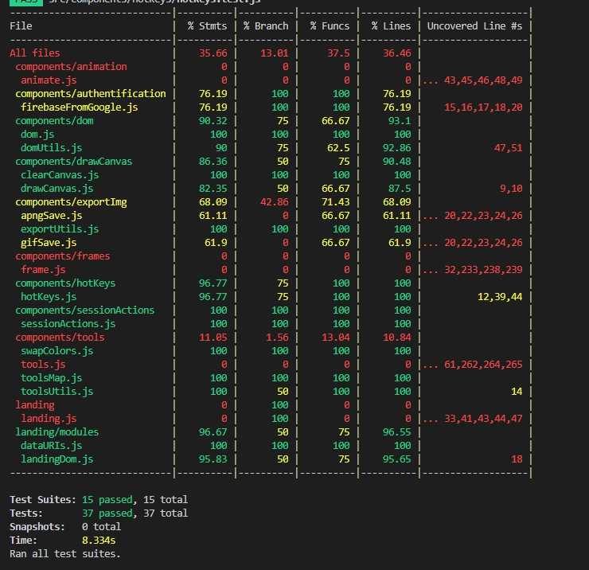

## Piskel-clone
| Deadline  | Folder name | Branch name |
|-----------|-------------|-------------|
| 23:59 08.01.2020 | simple-piskel-clone | simple-piskel-clone |

* student **[Aynur Shauerman](https://github.com/aykuli)**
* mentor **[Dina Mukhametshina](https://github.com/kamec)**

[Task](https://github.com/rolling-scopes-school/tasks/blob/master/tasks/piskel-clone.md)

## Prepare and test
1. Open folder with the project in [Visual Studio Code](https://code.visualstudio.com/download)

2. To install all dependencies use 

        npm install
        

3. To build project use

        npm run build

    There will appear folder `dist`, where will be files `index.html`, `main.js`, `main.css` and  folder `images`.
4. To run developing state use

        npm run dev
    
5. To check eslint errors run 

        npm run lint

6. To run jest tests 

        npm run test

7. To see test coverage in browser use

        npm run coverage:full

    and see it through browser `folder_where_is_your_project\aykuli-RS2019Q3/simple-piskel-clone/coverage/lcov-report/index.html`

8. To see test coverage in console

        npm run test -- --coverage

9. Current test coverage

