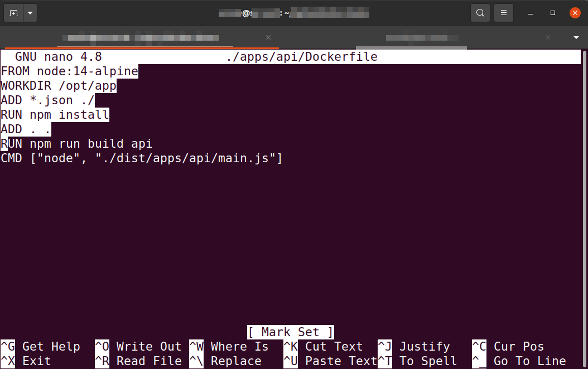

Just `Ctrl + K`. Step by step.

Or

1. Press `CTRL + Shift + 6` to mark the start of your block
2. Shift the cursor to the end of the block with the arrow keys, and it will outline the text.
3. Press CTRL + K to cut/delete a block and it will remove a line in nano.

---

- [source](https://monovm.com/blog/how-to-delete-line-in-nano-delete-all/)
